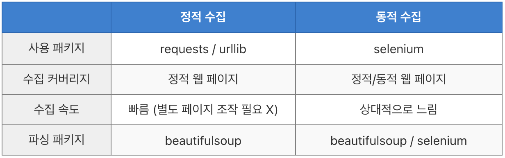

0. problem 
- 웹크롤링을 하면서 만나게 될 페이지는 크게 두가지, 정적(static)과 동적(dynamic) 웹페이지가 있다. 
- 정적, 동적 웹페이지의 작동 방식을 이해해야 성공적인 코드 작성 가능 

1. 정적 웹페이지
- 웹 서버에 이미 저장된 파일(html, 이미지,javaScript 등) 을 클라에게 전송하는 웹 페이지 
- 서버에 저장된 데이터가 변경되지 않는 한 모든 사용자는 같은 결과의 웹페이지를 서버에 요청하고 응답받게 된다. 
- 장점
    - 다른 처리 없이 요청에 대한 파일만 전송하기에 빠르다
    - 단순한 문서로 웹서버를 구축하므로 호스팅 서버 연결 비용 적다 

- 단점 
    - 저장된 정보만 보여준다 -> 서비스 한정적
    - 추가, 삭제, 수정 등의 작업이 모두 코드를 직접 건드려야 하기에 관리 힘들다 

2. 동적 웹페이지 
- url 만으로는 들어갈 수 없는 웹페이지 
- 또는 들어가지더라도 url 변화는 없는데 실시간으로 내용이 계속 추가되거나 수정되는 웹페이지 
- 요청에 관하여 사용자는 조건에 따라 다른 결과를 받게 된다
- 사용자는 상황, 시간, 요청 등에 따라 달라지는 웹페이지 보게 된다. 

3. 정적/동적 수집 
- 정적 페이지에서 정보를 수집하냐, 동적 페이지에서 하냐에 따라 파이썬 패키지 달라진다 

- 사용 패키지 
    - 정적 : requests / urllib
    - 동적 : selenium 
- 파싱 패키지 
    - 정적 : 뷰티풀숩
    - 동적 : 뷰티풀숩 / 셀레니움 